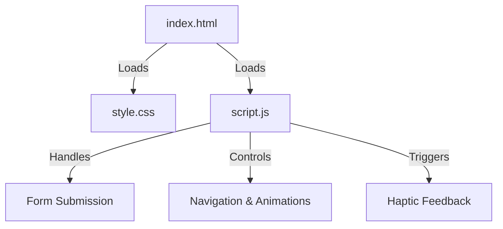

# Mondal_Products_Website

Due to privacy 🔏 reasons the source code files have been hidden.

## 🚀 Live Demo
Experience the live version of the project here:  
🔗 [Live Demo](https://mondal-products.vercel.app/)

---

# 📌 Mondal Products - Creative Solutions

## 🌟 Overview
Welcome to **Mondal Products - Creative Solutions**! This project delivers an interactive, visually appealing, and feature-rich website showcasing innovative tech solutions. 🚀

## 📁 Project Structure
The project consists of three primary files:

1. **index.html** (Structure & Content)
2. **style.css** (Styling & Animations)
3. **script.js** (Interactivity & Functionality)

---

## ⚙️ How the Code Works

### 🏗 HTML (index.html)
- Defines the website's structure.
- Includes navigation, hero section, about, products, team, and contact sections.
- Uses `meta` tags for SEO and Open Graph for social media sharing.
- Loads external stylesheets and JavaScript.
- Implements a search bar and form for user interaction.

### 🎨 CSS (style.css)
- Defines styles using CSS variables (`:root`) for color theming.
- Implements modern UI/UX with animations (e.g., `@keyframes`, `backdrop-filter`).
- Enhances navigation with a sticky navbar and smooth scrolling.
- Uses responsive design with `@media` queries for mobile support.

### ⚡ JavaScript (script.js)
- Manages form submission and integrates Google Sheets for data storage.
- Enhances UI with animations, smooth scrolling, and active link highlighting.
- Implements a **search feature** that dynamically suggests content.
- Adds **haptic feedback** to elements for a tactile experience.

---

## 🔗 How the Files Interconnect

- **HTML** loads the **CSS** for styling and **JavaScript** for interactivity.
- **JavaScript** listens for user interactions (e.g., clicking, scrolling) and updates UI dynamically.
- **CSS** ensures smooth animations, responsive design, and an elegant look.

---

## 🌟 Features

### 🔍 Smart Search System
- Users can search for tech solutions/products dynamically.
- Uses **event listeners** to provide real-time suggestions.

### 📜 Animated Navigation & Smooth Scrolling
- The **sticky navbar** changes appearance on scroll.
- Links highlight based on the active section.

### ⚡ Haptic Feedback (Tactile Experience)
- Vibrations are triggered on **buttons, links, and icons** for mobile users.
- Uses the `navigator.vibrate([45])` API for touch-based feedback.

### 📧 Contact Form Integration
- Sends data to Google Sheets upon form submission.
- Displays **loading animations** while submitting.

---

## 📞 Contact
💡 **Developed by:** [Md. Nayaj Mondal](https://my-portfolio-website-eight-pi.vercel.app/)  
🔗 **Website:** [Mondal Products](https://mondal-products.vercel.app/)  
📧 **Email:** md.n.m.pius18@gmail.com  

🌟 *Feel free to contribute, report issues, and star ⭐ the repository!*
